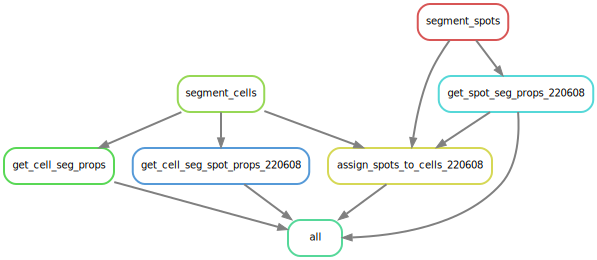

# README for microbial cell segmentation
## Purpose
This pipeline is used to segment cells in fluorescent images of bacteria as per [HiPRFISH](https://doi.org/10.1038/s41586-020-2983-4).
The algorithm uses local neighborhood enhancement designed by [Hao Shi](https://github.com/proudquartz).
This is a rewrite and parallelization of the code Hao designed.

## Package requirements
### For loading images
javabridge
bioformats
### General
pandas
numpy
jupyter
### Image processing
scikit-image
matplotlib
cython
scipy
scikit-learn
### Neighbor2d
You have to configure this package in the functions folder:
```
cython neighbor2d.pyx
```

## Configuration and execution
The MGEFISH_run folder has template files for running the pipeline to segment both cells and smFISH spots and assign spots to cells in non-spectral images. The HiPRFISH_run is only for segmenting cells in spectral images from Zeiss LSM 880 microscopes.  
First, use the config_example.yaml as a template and put your configuration file in the directory where you want to design probes. Make all of your filepaths in the configuration file relative to the directory where you want to design probes.
Second, use the nb_run.ipynb script in jupyter notebooks or the nb_run.py in Atom's Hydrogen package to set up your parameters and write your input table, note that the pipeline as written is for .czi files from zeiss microscopes.
Third, edit the Snakefile to comment in or out rules that you do or don't want to run. I suggest limiting the number of cores used for segmenting large images as the memory usage builds up quickly.
Last, edit the run.sh file to alter the number of cores and other snakemake run options
Then execute: ```sh run.sh```


## Workflow
Below is a rule graph of the Snakemake pipeline.

[](./dag.svg)

